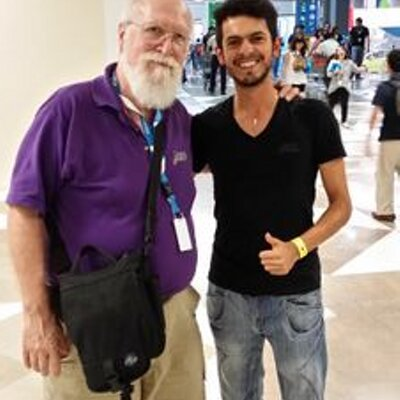

## Hi, I'm Hassan!



I'm a software engineer who is passionate about making open-source more accessible, creating technology to elevate people, and building community. Always curious to learn cutting edge technology. Love connecting with different people.

Thank you for taking the time to [review my Indeed resume](https://my.indeed.com/p/hassanfuada-nl4vimd) and my [Github page](https://github.com/4Federiz). You may want to send me an email and [get in touch](federiz.com) right away too! (It's false that computer people get scared by social interaction... sometimes... in daytime).

### 📣 Quick About_ME:

Talking about personal stuff.
- In case you have not guessed, I'm the one on the right (Sorry for the low-res, the photo was too epic not to be shared).
- Mexican born, American raised, Japanese fed.
- English, Spanish, some French and German will do too.
- Learning Dart and loving it! 💗
- Doing my best; always happy to help; can take no's; "The devil is in the detail".


### 🔥 Add me to your team, just copy-paste this:
```dart
const kHassan = {
  pronouns: "he" | "him",
  code: [Java, Dart, Python, SQL, C#],
  tools: [Firebase, Redux, Postgres, Provider, BLoC, AWS],
  architecture: ["microservices", "event-driven", "design system pattern"],
  assets: {
                        certifications: true,
                        relocationAvailability: true,
                        drinkEnoughCoffee: false
                      },
}
```

Still reading? [Hit me up](federiz.com)!
💾 EOF